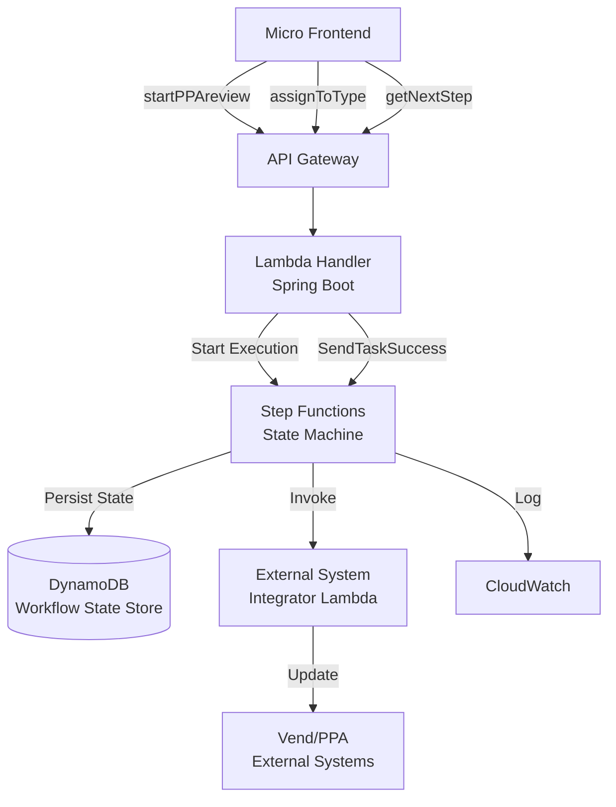
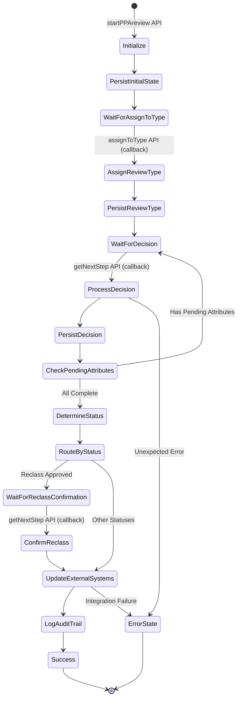
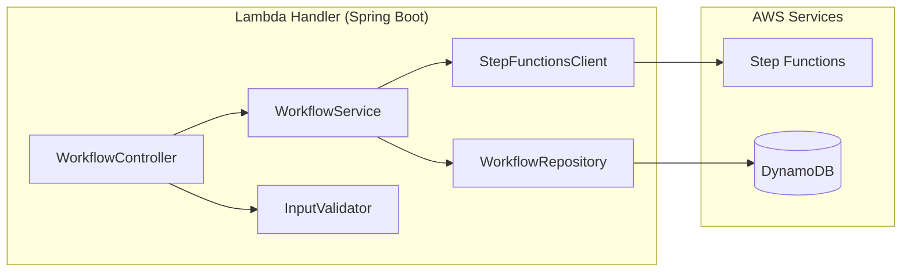

# Design Document: LDC Loan Review Workflow

## Overview

The LDC Loan Review Workflow is implemented as an AWS Step Functions state machine orchestrating Lambda-backed API handlers with DynamoDB persistence. The architecture follows a callback pattern: the MFE drives the workflow forward by invoking APIs that send task tokens back to Step Functions, resuming suspended executions. The system is designed as a Spring Boot application packaged as a Lambda function, following the project's layered architecture (Controller → Service → Repository).

## Architecture

### High-Level Architecture



### Step Functions State Machine Flow



### Component Architecture



## Components

### 1. API Layer (Controller)

**`WorkflowController`** — REST controller exposing three endpoints:

| Endpoint | Method | Path | Purpose |
|----------|--------|------|---------|
| startPPAreview | POST | `/api/v1/workflow/start` | Initiates workflow |
| assignToType | POST | `/api/v1/workflow/assign-type` | Updates review type |
| getNextStep | POST | `/api/v1/workflow/next-step` | Submits decisions / confirms reclass |

Each endpoint:
- Generates a correlation ID via `CorrelationIdGenerator`
- Delegates validation to `InputValidator`
- Delegates business logic to `WorkflowService`
- Returns standardized responses via `ApiResponse` wrapper

### 2. Validation Layer

**`InputValidator`** — Validates all API inputs at the trust boundary:

- Validates mandatory field presence
- Validates Request_Type against allowed enum values (`LDC`, `SEC_POLICY`, `CONDUIT`)
- Validates identifier formats (Request_Number, Loan_Number, Task_Number) against regex patterns
- Validates payload size does not exceed configured maximum
- Throws `ValidationException` with descriptive messages on failure

### 3. Service Layer

**`WorkflowService`** — Core business logic:

- **`startWorkflow(StartWorkflowRequest)`**: Generates Task_Number, starts Step Functions execution, returns Task_Number
- **`assignReviewType(AssignTypeRequest)`**: Sends task success with updated review type to Step Functions
- **`submitDecision(NextStepRequest)`**: Sends task success with decision data to Step Functions
- Uses `StepFunctionsClient` wrapper for AWS SDK calls
- Uses `WorkflowRepository` for direct DynamoDB reads (e.g., validating Task_Number exists)

**`StatusDeterminationService`** — Pure business logic for status determination (invoked within Step Functions Lambda):

- **`determineStatus(List<LoanAttribute>)`**: Applies status determination rules:
  - All Approved → `APPROVED`
  - All Rejected → `REJECTED`
  - Mix of Approved/Rejected → `PARTIALLY_APPROVED`
  - Any Repurchase → `REPURCHASE`
  - Any Reclass → `RECLASS_APPROVED`
- Priority order: `REPURCHASE` > `RECLASS_APPROVED` > `PARTIALLY_APPROVED` > `APPROVED` / `REJECTED`

**`ExternalSystemService`** — Handles downstream integration:

- **`updateExternalSystems(WorkflowState)`**: Invokes Vend/PPA integration (mock/placeholder)
- Uses Resilience4j circuit breaker for external calls
- Logs success/failure with correlation ID

### 4. Repository Layer

**`WorkflowRepository`** — DynamoDB data access:

- **`save(WorkflowState)`**: Persists workflow state
- **`findByRequestAndTask(String requestNumber, String taskNumber)`**: Retrieves workflow state
- **`updateStatus(String requestNumber, String taskNumber, String status)`**: Updates status field
- **`updateDecision(String requestNumber, String taskNumber, LoanDecision decision, List<LoanAttribute> attributes)`**: Updates decision and attributes

### 5. Step Functions Integration

**`StepFunctionsClientWrapper`** — Wraps AWS SDK Step Functions client:

- **`startExecution(String stateMachineArn, String input)`**: Starts new execution
- **`sendTaskSuccess(String taskToken, String output)`**: Resumes paused execution
- **`sendTaskFailure(String taskToken, String error, String cause)`**: Fails a paused execution

### 6. Step Functions State Machine Lambda Tasks

The state machine invokes Lambda functions for specific tasks within the workflow:

**`WorkflowTaskHandler`** — Lambda handler invoked by Step Functions for internal tasks:

- **Initialize**: Persists initial state to DynamoDB
- **PersistReviewType**: Updates review type in DynamoDB
- **ProcessDecision**: Persists decision, checks for pending attributes
- **DetermineStatus**: Calls `StatusDeterminationService`
- **UpdateExternalSystems**: Calls `ExternalSystemService`
- **LogAuditTrail**: Writes final audit record

## Data Models

### Request DTOs

```java
@Value
@Builder
public class StartWorkflowRequest {
    String requestNumber;    // Mandatory
    String loanNumber;       // Mandatory
    String requestType;      // Mandatory: LDC | Sec Policy | Conduit
    List<LoanAttributeDto> attributes; // Optional
}

@Value
@Builder
public class AssignTypeRequest {
    String taskNumber;       // Mandatory
    String requestNumber;    // Mandatory
    String loanNumber;       // Mandatory
    String reviewType;       // Mandatory: LDC | Sec Policy | Conduit
}

@Value
@Builder
public class NextStepRequest {
    String taskNumber;       // Mandatory
    String requestNumber;    // Mandatory
    String loanNumber;       // Mandatory
    String loanDecision;     // Mandatory
    List<LoanAttributeDto> attributes; // Mandatory
}

@Value
@Builder
public class LoanAttributeDto {
    String attributeName;
    String attributeStatus;  // Pending Review | Approved | Rejected | Repurchase | Reclass
}
```

### Response DTOs

```java
@Value
@Builder
public class ApiResponse<T> {
    boolean success;
    String message;
    String correlationId;
    T data;
    String errorCode;        // null on success
}

@Value
@Builder
public class StartWorkflowResponse {
    String taskNumber;
    String executionArn;
}
```

### Domain Models

```java
@Getter
@Setter
@NoArgsConstructor
@AllArgsConstructor
@Builder
public class WorkflowState {
    String requestNumber;    // Partition Key
    String taskNumber;       // Sort Key
    String loanNumber;
    String reviewType;       // LDC | SEC_POLICY | CONDUIT
    String workflowStatus;   // INITIALIZED | REVIEW_TYPE_ASSIGNED | PENDING_DECISION | DETERMINED | WAITING_CONFIRMATION | UPDATING_EXTERNAL | COMPLETED | FAILED
    String loanDecision;     // APPROVED | REJECTED | PARTIALLY_APPROVED | REPURCHASE | RECLASS_APPROVED
    List<LoanAttribute> attributes;
    String correlationId;
    String executionArn;
    String currentTaskToken;
    Instant createdAt;
    Instant updatedAt;
    Long ttl;                // DynamoDB TTL for data retention
}

@Value
@Builder
public class LoanAttribute {
    String attributeName;
    String attributeStatus;  // PENDING_REVIEW | APPROVED | REJECTED | REPURCHASE | RECLASS
}
```

### Enums

```java
public enum ReviewType {
    LDC, SEC_POLICY, CONDUIT;

    public static ReviewType fromString(String value) {
        // Maps "Sec Policy" → SEC_POLICY, "Conduit" → CONDUIT, "LDC" → LDC
    }
}

public enum WorkflowStatus {
    INITIALIZED, REVIEW_TYPE_ASSIGNED, PENDING_DECISION,
    DETERMINED, WAITING_CONFIRMATION, UPDATING_EXTERNAL,
    COMPLETED, FAILED
}

public enum LoanDecisionStatus {
    APPROVED, REJECTED, PARTIALLY_APPROVED, REPURCHASE, RECLASS_APPROVED
}

public enum AttributeStatus {
    PENDING_REVIEW, APPROVED, REJECTED, REPURCHASE, RECLASS
}
```

### DynamoDB Table Design

**Table: `ldc-workflow-state`**

| Attribute | Type | Key | Description |
|-----------|------|-----|-------------|
| requestNumber | String | Partition Key (PK) | Unique request identifier |
| taskNumber | String | Sort Key (SK) | Unique task identifier |
| loanNumber | String | — | Loan identifier |
| reviewType | String | — | LDC / SEC_POLICY / CONDUIT |
| workflowStatus | String | — | Current workflow state |
| loanDecision | String | — | Determined loan decision |
| attributes | List<Map> | — | Loan attributes with statuses |
| correlationId | String | — | Traceability ID |
| executionArn | String | — | Step Functions execution ARN |
| currentTaskToken | String | — | Active callback token |
| createdAt | String (ISO-8601) | — | Creation timestamp (UTC) |
| updatedAt | String (ISO-8601) | — | Last update timestamp (UTC) |
| ttl | Number | — | DynamoDB TTL epoch seconds |

**GSI: `loanNumber-index`**
- Partition Key: `loanNumber`
- Sort Key: `createdAt`
- Purpose: Query workflows by loan number

**Capacity**: On-demand (pay-per-request) for unpredictable workloads.
**Encryption**: AWS-managed KMS key (SSE).
**PITR**: Enabled for production.

## Correctness Properties

> *A property is a characteristic or behavior that should hold true across all valid executions of a system — essentially, a formal statement about what the system should do. Properties serve as the bridge between human-readable specifications and machine-verifiable correctness guarantees.*

### Prework Analysis

```
Acceptance Criteria Testing Prework:

1.1 WHEN startPPAreview API invoked with valid payload, start execution and return Task_Number
  Thoughts: We can generate random valid payloads and verify an execution starts and a Task_Number is returned. This is integration-level, better as example test.
  Testable: yes - example

1.2 Validate mandatory fields: Request_Number, Loan_Number, Request_Type
  Thoughts: For all subsets of mandatory fields where at least one is missing, validation should fail. This is a property over all combinations of missing fields.
  Testable: yes - property

1.3 WHEN mandatory field missing, reject with HTTP 400
  Thoughts: Edge case of 1.2 — the HTTP status is the assertion.
  Testable: edge-case

1.4 Validate Request_Type is one of allowed values
  Thoughts: For all strings that are NOT in the allowed set, validation should reject. For all strings IN the allowed set, validation should accept. This is a property.
  Testable: yes - property

1.5 WHEN Request_Type invalid, reject with HTTP 400
  Thoughts: Edge case of 1.4.
  Testable: edge-case

1.6 Persist initial state to Workflow_State_Store
  Thoughts: Integration test — verify DynamoDB write. Better as example.
  Testable: yes - example

1.7 Assign Review_Type from payload
  Thoughts: Subsumed by 1.6 persistence test.
  Testable: edge-case

1.8 Optional Attributes persisted alongside initial state
  Thoughts: Edge case of 1.6.
  Testable: edge-case

2.1 assignToType resumes execution with updated Review_Type
  Thoughts: Integration test.
  Testable: yes - example

2.2 Validate mandatory fields for assignToType
  Thoughts: Same property pattern as 1.2 but for different fields. Can combine into one property.
  Testable: yes - property (combined with 1.2)

2.3-2.5 assignToType validation and persistence
  Thoughts: Edge cases of 2.2 and integration tests.
  Testable: edge-case

3.1-3.3 getNextStep validation
  Thoughts: Same mandatory field validation property pattern.
  Testable: yes - property (combined with 1.2)

3.4 Persist submitted decision and attributes
  Thoughts: Integration test.
  Testable: yes - example

3.5 WHEN any attribute is Pending Review, loop back
  Thoughts: For any list of attributes where at least one is PENDING_REVIEW, the system should suspend. This is a property.
  Testable: yes - property

3.6 WHEN all attributes are non-pending, proceed to status determination
  Thoughts: Inverse of 3.5. For any list where none are PENDING_REVIEW, proceed. Combined with 3.5 into one property.
  Testable: yes - property (combined with 3.5)

4.1 All Approved → APPROVED
  Thoughts: For any non-empty list of attributes all with APPROVED status, determination should be APPROVED. Property.
  Testable: yes - property

4.2 All Rejected → REJECTED
  Thoughts: For any non-empty list all REJECTED, determination should be REJECTED. Property.
  Testable: yes - property

4.3 Mix of Approved and Rejected → PARTIALLY_APPROVED
  Thoughts: For any list with at least one APPROVED and at least one REJECTED (and no Repurchase/Reclass), determination should be PARTIALLY_APPROVED. Property.
  Testable: yes - property

4.4 Any Repurchase → REPURCHASE
  Thoughts: For any list containing at least one REPURCHASE, determination should be REPURCHASE. Property.
  Testable: yes - property

4.5 Any Reclass → RECLASS_APPROVED
  Thoughts: For any list containing at least one RECLASS (and no REPURCHASE), determination should be RECLASS_APPROVED. Property.
  Testable: yes - property

4.6 Persist determined status
  Thoughts: Integration test.
  Testable: yes - example

5.1 Non-reclass statuses route to external update
  Thoughts: For all statuses in {APPROVED, REJECTED, PARTIALLY_APPROVED, REPURCHASE}, routing should go to external update. Property.
  Testable: yes - property

5.2 Reclass routes to waiting for confirmation
  Thoughts: Specific case, example test.
  Testable: yes - example

5.3-5.4 Reclass confirmation flow
  Thoughts: Integration test.
  Testable: yes - example

6.1-6.3 External system update
  Thoughts: Integration tests with mocked external service.
  Testable: yes - example

7.1-7.3 Audit trail and completion
  Thoughts: Integration tests.
  Testable: yes - example

8.1-8.4 State persistence
  Thoughts: Architectural invariant — every transition persists state. Property.
  Testable: yes - property

9.1 Validate identifier formats
  Thoughts: For all strings not matching expected patterns, validation should reject. Property.
  Testable: yes - property

9.2 Reject oversized payloads
  Thoughts: Edge case.
  Testable: edge-case

9.3-9.5 Error handling
  Thoughts: Example tests.
  Testable: yes - example
```

### Property Reflection (Redundancy Elimination)

- Properties 1.2, 2.2, 3.1-3.3 (mandatory field validation) → Combined into **Property 1**: "Mandatory field validation rejects incomplete payloads"
- Properties 3.5 and 3.6 (pending check) → Combined into **Property 3**: "Pending attribute detection"
- Properties 4.1-4.5 (status determination) → These are distinct business rules with different logic paths. Keep as **Properties 4-8** but combine 4.1 and 4.2 into a single "homogeneous status" property since the logic is symmetric.
- Property 5.1 (routing) → Keep as **Property 9**
- Property 8.1-8.4 (state persistence invariant) → Keep as **Property 10** but this is better verified via integration tests. Remove as formal property.
- Property 9.1 (identifier format) → Keep as **Property 2**

### Final Correctness Properties

**Property 1: Mandatory field validation rejects incomplete payloads**
*For all* API request payloads (startPPAreview, assignToType, getNextStep) where at least one mandatory field is null or blank, the InputValidator shall return a validation error identifying the missing field(s). *For all* payloads where all mandatory fields are present and valid, the InputValidator shall accept the payload.
**Validates: Requirements 1.2, 1.3, 2.2, 2.3, 3.2, 3.3**

**Property 2: Identifier format validation**
*For all* strings that do not match the expected identifier pattern for Request_Number, Loan_Number, or Task_Number, the InputValidator shall reject the input. *For all* strings that match the expected pattern, the InputValidator shall accept the input.
**Validates: Requirements 9.1**

**Property 3: Request type validation accepts only allowed values**
*For all* strings in the set {"LDC", "Sec Policy", "Conduit"}, the ReviewType parser shall return a valid ReviewType enum. *For all* strings not in that set, the parser shall throw a validation error.
**Validates: Requirements 1.4, 1.5**

**Property 4: Pending attribute detection controls workflow progression**
*For any* non-empty list of LoanAttributes, if at least one attribute has status PENDING_REVIEW, the completion check shall return `false` (loop back). If no attribute has status PENDING_REVIEW, the completion check shall return `true` (proceed).
**Validates: Requirements 3.5, 3.6**

**Property 5: Homogeneous approved attributes yield APPROVED status**
*For any* non-empty list of LoanAttributes where every attribute has status APPROVED, the StatusDeterminationService shall return APPROVED.
**Validates: Requirements 4.1**

**Property 6: Homogeneous rejected attributes yield REJECTED status**
*For any* non-empty list of LoanAttributes where every attribute has status REJECTED, the StatusDeterminationService shall return REJECTED.
**Validates: Requirements 4.2**

**Property 7: Mixed approved/rejected attributes yield PARTIALLY_APPROVED**
*For any* list of LoanAttributes containing at least one APPROVED and at least one REJECTED (with no REPURCHASE or RECLASS), the StatusDeterminationService shall return PARTIALLY_APPROVED.
**Validates: Requirements 4.3**

**Property 8: Repurchase takes priority**
*For any* list of LoanAttributes containing at least one REPURCHASE, regardless of other statuses, the StatusDeterminationService shall return REPURCHASE.
**Validates: Requirements 4.4**

**Property 9: Reclass takes priority over partial/approved/rejected**
*For any* list of LoanAttributes containing at least one RECLASS and no REPURCHASE, the StatusDeterminationService shall return RECLASS_APPROVED.
**Validates: Requirements 4.5**

**Property 10: Non-reclass statuses route to external update**
*For all* LoanDecisionStatus values in {APPROVED, REJECTED, PARTIALLY_APPROVED, REPURCHASE}, the routing logic shall direct to the External System Update step. Only RECLASS_APPROVED shall route to the confirmation step.
**Validates: Requirements 5.1, 5.2**

## Error Handling

### Error Categories

| Category | HTTP Status | Error Code | Recovery |
|----------|-------------|------------|----------|
| Missing mandatory field | 400 | `VALIDATION_MISSING_FIELD` | Client fixes payload |
| Invalid field format | 400 | `VALIDATION_INVALID_FORMAT` | Client fixes payload |
| Invalid Request_Type | 400 | `VALIDATION_INVALID_REQUEST_TYPE` | Client fixes payload |
| Payload too large | 413 | `PAYLOAD_TOO_LARGE` | Client reduces payload |
| Workflow not found | 404 | `WORKFLOW_NOT_FOUND` | Client verifies Task_Number |
| External system failure | 502 | `EXTERNAL_SYSTEM_ERROR` | Retry with circuit breaker |
| Unexpected error | 500 | `INTERNAL_ERROR` | Logged with correlation ID |

### Exception Hierarchy

```
RuntimeException
├── WorkflowValidationException (400 errors)
│   ├── MissingFieldException
│   ├── InvalidFormatException
│   └── InvalidRequestTypeException
├── WorkflowNotFoundException (404)
├── ExternalSystemException (502)
└── WorkflowExecutionException (500)
```

### Circuit Breaker Configuration (Resilience4j)

- **Failure rate threshold**: 50%
- **Wait duration in open state**: 30 seconds
- **Sliding window size**: 10 calls
- **Applied to**: `ExternalSystemService.updateExternalSystems()`

## Testing Strategy

### Unit Tests
- `InputValidatorTest` — Validates all field presence, format, and type rules
- `StatusDeterminationServiceTest` — Tests all status determination logic paths
- `WorkflowServiceTest` — Tests service orchestration with mocked dependencies
- `WorkflowControllerTest` — Tests endpoint routing, validation delegation, response formatting

### Property-Based Tests (jqwik)
- `InputValidatorPropertyTest` — Properties 1, 2, 3 (validation properties)
- `StatusDeterminationPropertyTest` — Properties 4-9 (status determination and pending check)
- `WorkflowRoutingPropertyTest` — Property 10 (routing logic)

### Integration Tests
- `WorkflowRepositoryIntegrationTest` — DynamoDB CRUD operations
- `WorkflowEndToEndIntegrationTest` — Full workflow lifecycle with mocked AWS services

### Test Configuration
- jqwik: Minimum 100 iterations per property test
- Mockito: Mock AWS SDK clients (StepFunctionsClient, DynamoDbClient)
- AssertJ: Fluent assertions throughout
- Coverage target: ≥ 80% on all new classes
