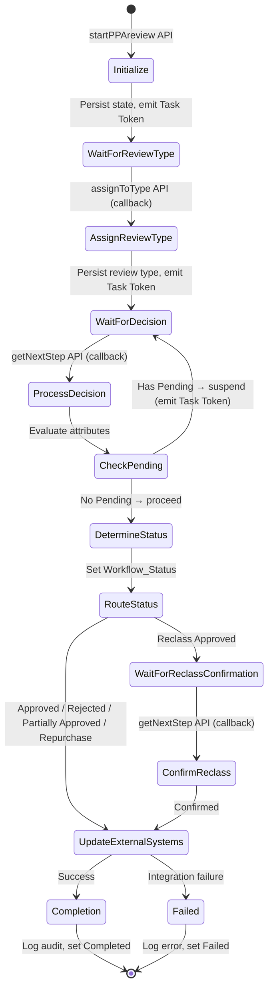
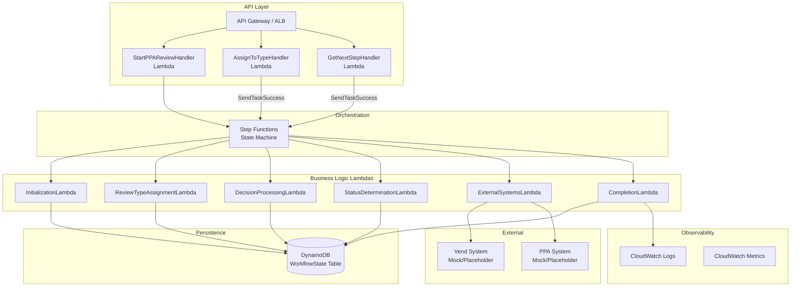
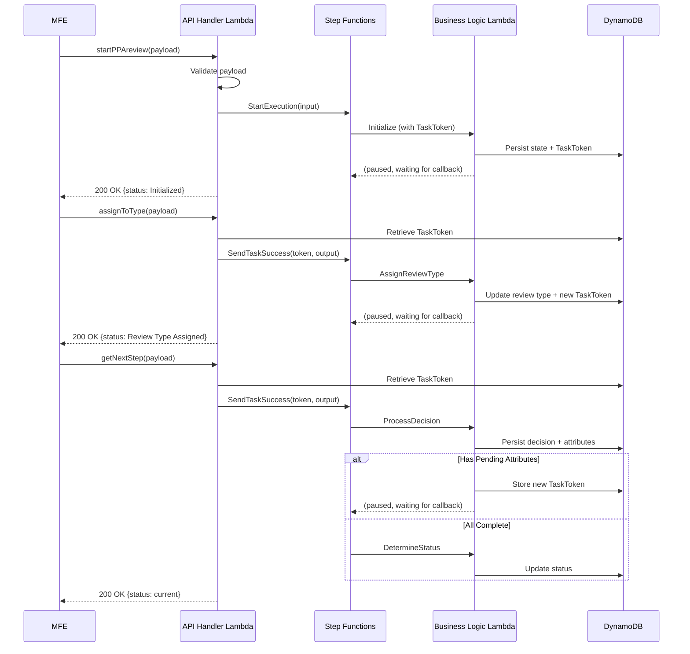

# Design Document: LDC Loan Review Workflow

## Overview

The LDC Loan Review Workflow implements a Step Functions-orchestrated, callback-driven state machine for processing loan reviews. Three API endpoints (`startPPAreview`, `assignToType`, `getNextStep`) drive the workflow forward. The MFE is the sole source of truth for loan decisions and attributes — the workflow trusts API payloads and persists them without independent DB lookups.

The architecture uses the **Task Token callback pattern**: at each human-interaction point, the Step Function pauses and emits a Task Token. The API Handler stores this token in DynamoDB. When the MFE calls the next API, the handler retrieves the token and calls `SendTaskSuccess` to resume the execution.

## Architecture

### Step Functions State Machine



### Component Architecture



### Callback Pattern Flow



## Data Models

### DynamoDB Table Design

**Table Name:** `LoanReviewWorkflowState`

| Attribute | Type | Key | Description |
|---|---|---|---|
| `requestNumber` | String | Partition Key (PK) | Unique request identifier |
| `loanNumber` | String | Sort Key (SK) | Unique loan identifier |
| `taskNumber` | String | — | Step Functions execution task identifier |
| `executionArn` | String | — | Step Functions execution ARN |
| `taskToken` | String | — | Current callback task token |
| `requestType` | String | — | LDC, Sec Policy, or Conduit |
| `reviewType` | String | — | Assigned review classification |
| `workflowStatus` | String | — | Current workflow status |
| `loanDecision` | String | — | Latest loan decision |
| `loanAttributes` | List&lt;Map&gt; | — | Nested attribute list with statuses |
| `auditTrail` | List&lt;Map&gt; | — | List of status transition records |
| `reclassConfirmation` | Map | — | Confirmation details (timestamp, action) |
| `correlationId` | String | — | Unique ID for request tracing |
| `createdTimestamp` | String (ISO-8601) | — | Creation time in UTC |
| `lastModifiedTimestamp` | String (ISO-8601) | — | Last update time in UTC |
| `completedTimestamp` | String (ISO-8601) | — | Completion time in UTC |

**GSI-1:** `taskNumber-index`
- Partition Key: `taskNumber`
- Projection: ALL
- Purpose: Look up workflow state by Task_Number for callback APIs

**Loan Attribute Structure (nested):**
```json
{
  "attributeName": "string",
  "attributeStatus": "Pending Review | Approved | Rejected | Repurchase | Reclass",
  "updatedTimestamp": "ISO-8601 UTC"
}
```

**Audit Trail Entry Structure (nested):**
```json
{
  "previousStatus": "string",
  "newStatus": "string",
  "timestamp": "ISO-8601 UTC",
  "triggeringAction": "string",
  "correlationId": "string"
}
```

### Domain Models (Java)

```java
// Enums
public enum RequestType { LDC, SEC_POLICY, CONDUIT }
public enum AttributeStatus { PENDING_REVIEW, APPROVED, REJECTED, REPURCHASE, RECLASS }
public enum WorkflowStatus {
    INITIALIZED, REVIEW_TYPE_ASSIGNED, DECISION_PENDING,
    APPROVED, REJECTED, PARTIALLY_APPROVED, REPURCHASE,
    RECLASS_APPROVED, WAITING_FOR_CONFIRMATION,
    UPDATING_EXTERNAL_SYSTEMS, COMPLETED, FAILED
}

// Domain Entity
@Data @Builder
public class WorkflowState {
    private String requestNumber;
    private String loanNumber;
    private String taskNumber;
    private String executionArn;
    private String taskToken;
    private RequestType requestType;
    private String reviewType;
    private WorkflowStatus workflowStatus;
    private String loanDecision;
    private List<LoanAttribute> loanAttributes;
    private List<AuditTrailEntry> auditTrail;
    private ReclassConfirmation reclassConfirmation;
    private String correlationId;
    private Instant createdTimestamp;
    private Instant lastModifiedTimestamp;
    private Instant completedTimestamp;
}

@Data @Builder
public class LoanAttribute {
    private String attributeName;
    private AttributeStatus attributeStatus;
    private Instant updatedTimestamp;
}

@Data @Builder
public class AuditTrailEntry {
    private WorkflowStatus previousStatus;
    private WorkflowStatus newStatus;
    private Instant timestamp;
    private String triggeringAction;
    private String correlationId;
}

@Data @Builder
public class ReclassConfirmation {
    private Instant confirmationTimestamp;
    private String confirmingAction;
}
```

### API Request/Response DTOs

```java
// --- startPPAreview ---
@Data @Builder
public class StartPPAReviewRequest {
    @NotBlank private String requestNumber;
    @NotBlank private String loanNumber;
    @NotNull private RequestType requestType;
    private List<LoanAttributeDto> attributes; // optional
}

// --- assignToType ---
@Data @Builder
public class AssignToTypeRequest {
    @NotBlank private String taskNumber;
    @NotBlank private String requestNumber;
    @NotBlank private String loanNumber;
    @NotBlank private String reviewType;
}

// --- getNextStep ---
@Data @Builder
public class GetNextStepRequest {
    @NotBlank private String taskNumber;
    @NotBlank private String requestNumber;
    @NotBlank private String loanNumber;
    @NotBlank private String loanDecision;
    @NotNull private List<LoanAttributeDto> attributes;
}

@Data @Builder
public class LoanAttributeDto {
    private String attributeName;
    private AttributeStatus attributeStatus;
}

// --- Common Response ---
@Data @Builder
public class WorkflowResponse {
    private String requestNumber;
    private String loanNumber;
    private String status;
    private String message;
    private String correlationId;
    private String taskNumber;
}
```


## Correctness Properties

*A property is a characteristic or behavior that should hold true across all valid executions of a system — essentially, a formal statement about what the system should do. Properties serve as the bridge between human-readable specifications and machine-verifiable correctness guarantees.*

### Prework Summary

After analyzing all 44 acceptance criteria, the following were identified as testable properties (universal rules over input spaces). Criteria testable only as examples (specific scenarios) are covered by unit tests in the Testing Strategy. Redundant properties were consolidated:

- **1.2 + 1.3 consolidated**: Validation of startPPAreview mandatory fields (missing field → 400) is one property.
- **2.3 + 2.4 consolidated**: Validation of assignToType mandatory fields is one property.
- **3.2 + 3.3 consolidated**: Validation of getNextStep mandatory fields is one property.
- **4.1–4.5 consolidated**: Status determination from attribute statuses is one comprehensive property.
- **5.1 + 5.2 consolidated**: Status routing is one property (direct vs. reclass path).
- **11.1 + 11.4 consolidated**: API response structure (required fields + correlation ID) is one property.

### Property 1: startPPAreview Payload Validation

*For all* payloads submitted to the `startPPAreview` API where at least one of Request_Number, Loan_Number, or Request_Type is missing or null, the API_Handler shall return a 400 Bad Request response, and the error message shall identify every missing field.

**Validates: Requirements 1.2, 1.3**

### Property 2: Request Type Validation

*For all* string values provided as Request_Type that are not exactly one of `LDC`, `Sec Policy`, or `Conduit`, the API_Handler shall return a 400 Bad Request response indicating the invalid Request_Type value.

**Validates: Requirements 1.4**

### Property 3: assignToType Payload Validation

*For all* payloads submitted to the `assignToType` API where at least one of Task_Number, Request_Number, Loan_Number, or Review_Type is missing or null, the API_Handler shall return a 400 Bad Request response identifying every missing field.

**Validates: Requirements 2.3, 2.4**

### Property 4: getNextStep Payload Validation

*For all* payloads submitted to the `getNextStep` API where at least one of Task_Number, Request_Number, Loan_Number, Loan_Decision, or Attributes is missing or null, the API_Handler shall return a 400 Bad Request response identifying every missing field.

**Validates: Requirements 3.2, 3.3**

### Property 5: Pending Attribute Detection

*For all* non-empty lists of Loan_Attributes, the Workflow_Engine correctly identifies whether any attribute has an Attribute_Status of `Pending Review`. If at least one attribute is pending, the result is "has pending"; if none are pending, the result is "all complete".

**Validates: Requirements 3.4**

### Property 6: Status Determination from Attributes

*For all* non-empty lists of Loan_Attributes where no attribute has `Pending Review` status, the Workflow_Engine shall determine the Workflow_Status according to these rules (evaluated in priority order):
1. If any attribute is `Reclass` → `Reclass Approved`
2. If any attribute is `Repurchase` → `Repurchase`
3. If all attributes are `Approved` → `Approved`
4. If all attributes are `Rejected` → `Rejected`
5. If attributes are a mix of `Approved` and `Rejected` → `Partially Approved`

**Validates: Requirements 4.1, 4.2, 4.3, 4.4, 4.5**

### Property 7: Status Routing Correctness

*For all* determined Workflow_Statuses, the Workflow_Engine shall route:
- `Approved`, `Rejected`, `Partially Approved`, `Repurchase` → Update External Systems step
- `Reclass Approved` → Reclass Confirmation step (with status set to `Waiting for Confirmation`)

No other Workflow_Status values shall reach the routing step.

**Validates: Requirements 5.1, 5.2**

### Property 8: Audit Trail Completeness

*For all* sequences of Workflow_Status transitions performed on a workflow, the Workflow_Repository shall contain an Audit_Trail entry for each transition. The number of Audit_Trail entries shall equal the number of status transitions, and each entry shall contain non-null previousStatus, newStatus, timestamp, and triggeringAction fields.

**Validates: Requirements 8.2**

### Property 9: Last Modified Timestamp Invariant

*For all* update operations on the Workflow_Repository, the `lastModifiedTimestamp` field shall be updated to a value that is greater than or equal to the previous `lastModifiedTimestamp` value.

**Validates: Requirements 10.3**

### Property 10: API Response Structure Compliance

*For all* API responses returned by the API_Handler (success or error), the JSON response body shall contain non-null values for `requestNumber`, `loanNumber`, `status`, and `message` fields, and shall include a non-empty `correlationId` field.

**Validates: Requirements 11.1, 11.4**

### Property 11: Error Response Opacity

*For all* API error responses with HTTP status 500, the response message shall not contain stack traces, class names, internal exception messages, or DynamoDB table names.

**Validates: Requirements 11.3**

### Property 12: Invalid Task Number Rejection

*For all* API requests (`assignToType`, `getNextStep`) where the Task_Number does not correspond to any active workflow execution in the Workflow_Repository, the API_Handler shall return a 404 Not Found response.

**Validates: Requirements 9.4**

## Error Handling

### Failure Modes and Recovery

| Failure Mode | Detection | Recovery | Status |
|---|---|---|---|
| Invalid API payload | Request validation | Return 400 with field-level errors | No state change |
| Task_Number not found | DynamoDB lookup miss | Return 404 | No state change |
| DynamoDB write failure | SDK exception | Throw `WorkflowPersistenceException` with context | Caller handles retry |
| Step Functions callback failure | SDK exception | Log error, return 500 with correlation ID | Execution remains paused |
| External system integration failure | Lambda invocation error | Retry 2x with exponential backoff, then set `Failed` | `Failed` |
| Unexpected Lambda error | Catch-all handler | Log full error to CloudWatch, return 500 with correlation ID | Depends on step |

### Exception Hierarchy

```java
public class WorkflowException extends RuntimeException { /* base */ }
public class WorkflowValidationException extends WorkflowException { /* 400 errors */ }
public class WorkflowNotFoundException extends WorkflowException { /* 404 errors */ }
public class WorkflowPersistenceException extends WorkflowException { /* DynamoDB errors */ }
public class ExternalSystemException extends WorkflowException { /* integration errors */ }
```

### Retry Strategy

- **Lambda retries**: Configured in Step Functions ASL with `Retry` blocks — 2 retries, exponential backoff (2s, 4s).
- **DynamoDB retries**: AWS SDK built-in retry with default configuration.
- **External system retries**: Handled by Step Functions `Retry` on the integration Lambda task.

## Testing Strategy

### Dual Testing Approach

| Test Type | Framework | Purpose | Coverage Target |
|---|---|---|---|
| Unit Tests | JUnit 5 + Mockito + AssertJ | Specific examples, edge cases, error conditions | ≥ 80% line coverage |
| Property-Based Tests | jqwik | Universal properties across generated inputs | 100 iterations per property |

### Unit Test Coverage

- **Validation logic**: Each API handler validates mandatory fields, invalid enums, edge cases (empty strings, null values)
- **Status determination**: All 5 status outcomes + edge cases (single attribute, large attribute lists)
- **Routing logic**: Each status routes to the correct next step
- **Audit trail**: Entries created for each transition
- **Error handling**: DynamoDB failures, Step Functions callback failures, external system failures
- **Timestamp management**: UTC timestamps set correctly on create and update

### Property-Based Test Coverage

Each correctness property (1–12) maps to a dedicated jqwik property test:

| Property | Test Class | Generator Strategy |
|---|---|---|
| P1: startPPAreview validation | `StartPPAReviewValidationProperties` | Generate payloads with random null/missing field combinations |
| P2: Request type validation | `RequestTypeValidationProperties` | Generate arbitrary strings excluding valid values |
| P3: assignToType validation | `AssignToTypeValidationProperties` | Generate payloads with random null/missing field combinations |
| P4: getNextStep validation | `GetNextStepValidationProperties` | Generate payloads with random null/missing field combinations |
| P5: Pending detection | `PendingAttributeDetectionProperties` | Generate attribute lists with random statuses |
| P6: Status determination | `StatusDeterminationProperties` | Generate non-pending attribute lists with random statuses |
| P7: Status routing | `StatusRoutingProperties` | Generate all valid terminal statuses |
| P8: Audit trail completeness | `AuditTrailProperties` | Generate random sequences of status transitions |
| P9: Timestamp invariant | `TimestampInvariantProperties` | Generate sequences of update operations |
| P10: Response structure | `ApiResponseStructureProperties` | Generate random valid/invalid API requests |
| P11: Error opacity | `ErrorResponseOpacityProperties` | Generate error scenarios, check response content |
| P12: Invalid task number | `InvalidTaskNumberProperties` | Generate random non-existent task numbers |

### Test Configuration

- jqwik minimum iterations: 100 per property
- Each property test tagged: `@Tag("Feature: ldc-loan-review-workflow, Property N: {title}")`
- AssertJ assertions only (no Hamcrest, no JUnit assertions)
- Constructor injection for test dependencies
- No field-level `@Autowired`
